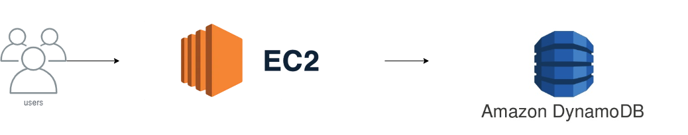

# demo-unifi-2024-10-15
## IaaS

### Architecture


### Manual (bad way)

* create dynamodb table
* create ec2 instance
* IAM association
* security group setup
* ssh and run python app

* as root
```
yum update -y
yum install python3 -y
curl -O https://bootstrap.pypa.io/get-pip.py
pip3 install boto3 flask gunicorn
```
* as ec2-user
```
export AWS_DEFAULT_REGION=eu-central-1
export FLASK_RUN_HOST=0.0.0.0
flask --app main run
or
gunicorn -w 15 -b 0.0.0.0:5000 main:app --daemon
```
* test it! postman collection

### IaC (right way)
#### Login
cd IaaS

```
export AWS_REGION=eu-central-1
export AWS_ACCESS_KEY_ID=***
export AWS_SECRET_ACCESS_KEY=***
```

#### Terraform
terraform init
terraform apply --var-file=env/development.tfvars
terraform apply --var-file=env/production.tfvars

```
export DYNAMODB_TABLE_NAME=${tableName}
export AWS_DEFAULT_REGION=eu-central-1
export FLASK_RUN_HOST=0.0.0.0
flask --app main run
or
gunicorn -w 15 -b 0.0.0.0:5000 main:app --daemon
```

## FaaS
### Architecture


### Manual (bad way)
https://docs.aws.amazon.com/apigateway/latest/developerguide/http-api-dynamo-db.html

### IaC (right way)
#### Login
```
export AWS_REGION=eu-central-1
export AWS_ACCESS_KEY_ID=***
export AWS_SECRET_ACCESS_KEY=***
```

#### Terraform
terraform init
terraform apply --var-file=env/development.tfvars
terraform apply --var-file=env/production.tfvars

#### Tests
curl https://o5spyqva1e.execute-api.eu-central-1.amazonaws.com/items

curl -X "PUT" -H "Content-Type: application/json" -d "{\"id\": \"123\", \"price\": 12345, \"name\": \"myitem\"}" https://o5spyqva1e.execute-api.eu-central-1.amazonaws.com/items

curl -X "PUT" -H "Content-Type: application/json" -d "{\"id\": \"123\", \"price\": 12345, \"name\": \"myitem\"}" https://2mtuinph5g.execute-api.eu-central-1.amazonaws.com/items

